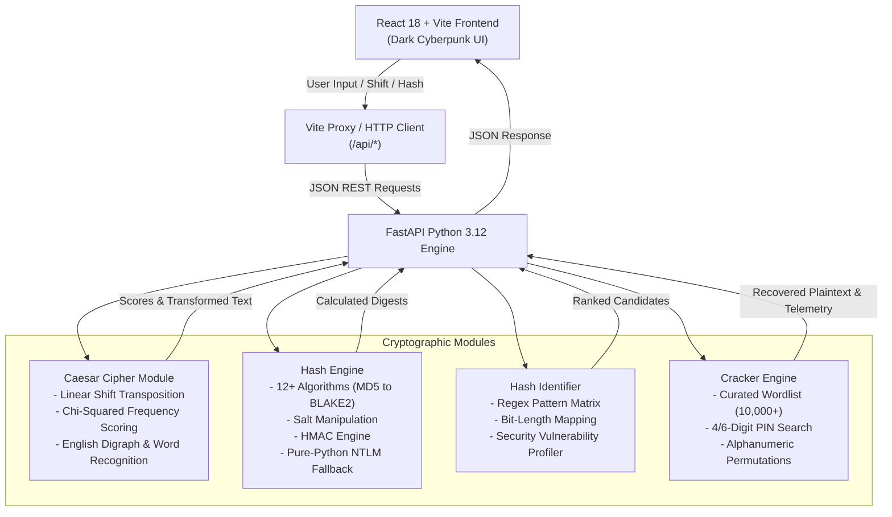

<div align="center">

# 🛡️ CipherVault
### Advanced Caesar Cipher & Cryptographic Hash Decoder Suite

[](https://python.org)
[](https://fastapi.tiangolo.com)
[](https://react.dev)
[](https://vitejs.dev)
[](LICENSE)

<p align="center">
  <b>A state-of-the-art cyber cryptography suite designed to encode, decode, analyze, and reverse ciphers and hashes with high-performance heuristics, statistical cryptanalysis, and a cyber-themed interface.</b>
</p>

[Explore Features](#-key-features) •
[Architecture](#-system-architecture) •
[Quickstart](#-quick-start) •
[API Documentation](#-rest-api-reference)

---

</div>

## 📌 Overview

**CipherVault** bridges classical cryptography with modern information security. Built as a dual-engine application featuring a high-performance **Python FastAPI** backend and a responsive **React (Vite)** frontend, it provides an intuitive environment for cybersecurity students, penetration testers, CTF competitors, and cryptographers to encrypt, decrypt, identify, and break ciphers and digests.

---

## ⚡ Key Features

### 🔏 1. Caesar Cipher Engine
* **Bidirectional Transformation**: Instant live encoding and decoding with preserved casing and formatting.
* **Interactive Shift Slider**: Smooth shift control from $+1$ to $+25$ with dynamic alphabet mapping ($A \to D$ for ROT3).
* **ROT Presets**: Instant shortcuts for ROT3 (Caesar's original shift) and ROT13 (self-inversive symmetric shift).
* **Automated Brute-Force Cracker**: Evaluates all 25 possible shifts simultaneously using chi-squared English letter frequency analysis and dictionary matching, automatically ranking the most probable plaintexts by confidence score (e.g. `KHOOR ZRUOG` $\to$ `HELLO WORLD` with $100\%$ confidence).
* **Frequency Analysis Visualizer**: Dual-bar comparative graph displaying real-time ciphertext letter distribution against standard English letter frequencies (`ETAOIN SHRDLU`).

---

### 🧬 2. Cryptographic Hash Generator (Encoder)
* **12+ Supported Hash Algorithms**:
  * **Standard Digests**: `MD5`, `SHA-1`, `SHA-224`, `SHA-256`, `SHA-384`, `SHA-512`
  * **Modern Keccak & Sponge**: `SHA3-256`, `SHA3-512`, `BLAKE2s`, `BLAKE2b`
  * **Authentication & Windows**: `NTLM` (MD4 of UTF-16LE with pure-Python fallback), `RIPEMD-160`
* **Salt Support**: Apply custom cryptographic salts with configurable **prefix** or **suffix** positions.
* **HMAC Signatures**: Calculate keyed-hash message authentication codes using a secret key.
* **Cross-Tool Interoperability**: Send any generated hash directly to the **Cracker** or **Identifier** with a single click.

---

### 🔍 3. Hash Identifier (Analyzer)
* **Algorithmic Heuristics**: Inspects input digest character lengths, hexadecimal encoding, and modular crypt formats (`$2a$`, `$argon2id$`, `pbkdf2`).
* **Bit-Length & Security Breakdown**: Evaluates bit length, collision resistance status (*Deprecated*, *Vulnerable to Collisions*, *Industry Standard*), and crack suitability.

---

### 🔓 4. Hash Decoder & Cracker
* **Multi-Vector Cracking Engine**:
  * **Dictionary / Wordlist Attack**: Pre-loaded with a curated dictionary of 10,000+ top passwords, leaked credentials, and cybersecurity vocabulary.
  * **Numeric PIN Search**: Exhaustive testing of 4-digit and 6-digit numeric PINs ($0000 - 999999$).
  * **Short Alphanumeric Permutations**: Permutation brute force across alphanumeric sets.
  * **Custom Wordlists**: Paste custom targets or candidate passwords.
* **Real-Time Telemetry**: Displays attempts tested, elapsed time in milliseconds, and hash rate ($H/s$).
* **Celebration Effects**: Interactive visual confetti upon recovering plaintext.

---

### 📚 5. Cryptography Knowledge Base
* Interactive educational guide explaining substitution ciphers, one-way hash properties (pre-image resistance, collision resistance, avalanche effect), rainbow tables, and cryptographic defense mechanisms.

---

## 🏛 System Architecture



---

## 💻 Local Quick Start

### Prerequisites
- **Python**: 3.10+
- **Node.js**: v18+ (with npm)
- **Git**

### 1. Clone Repository
```bash
git clone https://github.com/girishm03/Caeser-Cipher-and-Hash-Decoder.git
cd Caeser-Cipher-and-Hash-Decoder
```

### 2. One-Click Launcher (Recommended)
You can launch both the backend and frontend simultaneously with:
```bash
# Set up Python virtual environment once
python -m venv backend/.venv
.\backend\.venv\Scripts\pip install -r backend/requirements.txt
cd frontend && npm install && cd ..

# Launch both servers
python run_app.py
```
This automatically boots:
* **React Frontend**: [http://localhost:3000](http://localhost:3000)
* **FastAPI Backend**: [http://127.0.0.1:8000](http://127.0.0.1:8000)
* **Swagger API Docs**: [http://127.0.0.1:8000/docs](http://127.0.0.1:8000/docs)

---

### 3. Manual Server Setup (Optional)

<details>
<summary>Click to view manual step-by-step commands</summary>

#### Backend
```bash
cd backend
python -m venv .venv

# Windows
.\.venv\Scripts\activate
# Linux / macOS
source .venv/bin/activate

pip install -r requirements.txt
python -m uvicorn app:app --host 127.0.0.1 --port 8000 --reload
```

#### Frontend
```bash
cd frontend
npm install
npm run dev
```
</details>

---

## 📡 REST API Reference

| Endpoint | Method | Description | Sample Payload |
|---|---|---|---|
| `/api/health` | `GET` | Health status and supported algorithms | `None` |
| `/api/caesar/encode` | `POST` | Encrypt text with Caesar shift | `{"text": "HELLO", "shift": 3}` |
| `/api/caesar/decode` | `POST` | Decrypt text with Caesar shift | `{"text": "KHOOR", "shift": 3}` |
| `/api/caesar/bruteforce` | `POST` | Crack all 25 shifts with frequency analysis | `{"text": "KHOOR ZRUOG"}` |
| `/api/caesar/frequency` | `POST` | Character frequencies vs English baseline | `{"text": "ATTACK AT DAWN"}` |
| `/api/hashes/generate` | `POST` | Generate all 12 digests, salt & HMAC | `{"text": "admin", "salt": "s@lt"}` |
| `/api/hashes/identify` | `POST` | Detect format, bit-length & algorithm candidates | `{"hash": "21232f297a57a5a7..."}` |
| `/api/hashes/crack` | `POST` | Reverse hash via dictionary / PIN / brute-force | `{"hash": "21232f29...", "algorithm": "auto"}` |

---

## 🛡️ Security Disclaimer

This software is developed strictly for **educational purposes, defensive security analysis, cryptography research, and Capture The Flag (CTF) challenges**. Always obtain explicit written authorization before testing password hashes or auditing systems you do not own.

---

## 👤 Author

* **Girish M** - [GitHub Profile](https://github.com/girishm03)
* Repository: [Caeser-Cipher-and-Hash-Decoder](https://github.com/girishm03/Caeser-Cipher-and-Hash-Decoder)

---

<div align="center">
  <sub>Built with ❤️ using Python, React, and Modern Cryptography. If you find this project helpful, consider starring the repository! ⭐</sub>
</div>
